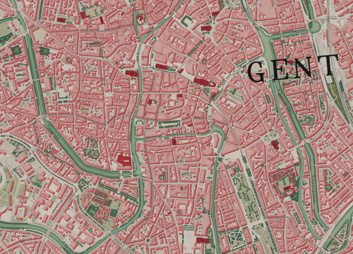
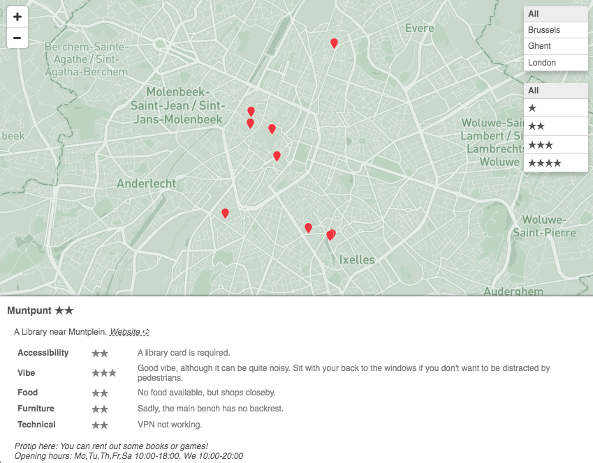
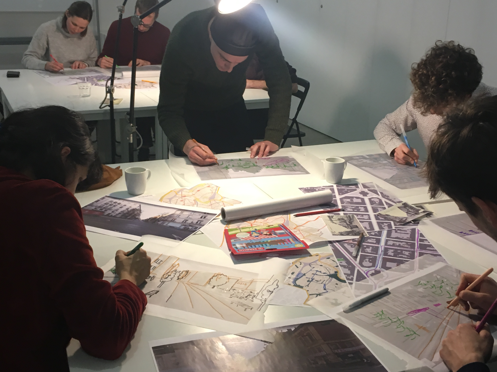
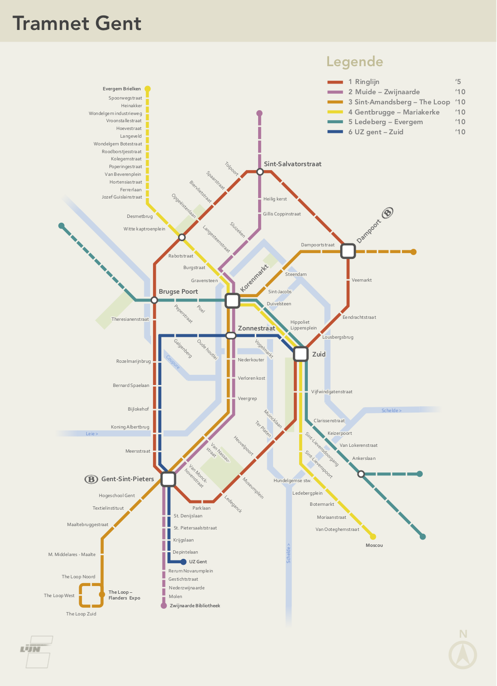

    
    

        <h2>Hi, I'm Manuel.</h2>
        

            As a freelance cartographer I make interactive and printed maps and apply geospatial algorithms for the greater good.
        

        

            <a href="mailto:manuel.claeys.b@gmail.com" class="email">manuel.claeys.b@gmail.com</a> 
            <a href="tel:+32485748811" class="phone">0485 74 88 11</a>
        

    

# How I can help you

*Need an interactive map so your users can explore your data? Want to explain your research in a journal or newspaper using a high-quality map?*

## I make <mark>interactive and printed maps</mark>.

I use <mark>state-of-the-art</mark> tools to visualise your data as a static, printable map (using *QGIS* as my main workhorse) or as an interactive (story-)map (using *Mapbox/MapLibre GL JS*, *Leaflet*, *uMap*, ...). Layer by layer, I carefully build up your map complementing your data with Open Data and/or satellite layers and explanatory graphs. With an <mark>eye for detail</mark> I take care of advanced aspects like *label placement*, *relief shading* and an *accessible color system*, all while respecting your visual identity.

*Overloaded with messy datasets or Excel-sheets? Need to compare or combine databases and have no idea on how to start?*

## I help you <mark>make sense of your data</mark>.

I carefully clean your data and include a <mark>structured notebook report</mark> on my analysis of your (spatial) research questions (using tools like *R*, *Jupyter* and *D3.js*). I can help you orient in the world of statistical tests, predictive models and Machine Learning and apply the most fitting approach. In the longer run, I can help you set up a <mark>data processing pipeline</mark>, enabling things like automated reports, connected databases and APIs. 

*Need to efficiently compute how many households in your huge dataset lie within a certain distance of forests (or polluting factories)? Does your project required you to draw optimal shortest routes with multiple stops?*

## I scout <mark>cutting-edge algorithms</mark> for your, and put them into action.

There are incredible -- but sometimes scary -- <mark>geospatial algorithms</mark> to be found in the realms of computational geometry, geodesy and routing. They enable us to answer many (but not all) complicated questions on your data. My background in -- and love for -- Maths, geometry and linear algebra give me the necessary tools to find out which ones can be used for your tasks. I implement them for your and deliver the resulting output, as well as the clean and well documented code. The engineer in me also looks forward to your <mark>remote sensing</mark> and hyperspectral image processing challenges.

<h1 class="with-margin-top">My previous experience</h1>

I was born in 1989 and live in ~~Ghent~~ Brussels. After my studies as an engineer in Applied Physics, I've followed by love for <mark>maps, Maths and geomatics</mark> and worked as a PhD student at the UGent department of Geography working on historical cartography (and their deformations), map projections and predictive algorithms. I later joined an NGO as a GIS-officer and data-scientist, making maps and helping researchers understand their data. I've also undertaken some GIS projects in my spare time: building a citizen-driven mobility plan, recreating 18th century map-style and computing the cycling potential of Brussels' streets.

I'm on team *Open Knowledge*; contributing to OpenStreetMap, using <mark>Open Source tools</mark> and sharing my own code, learnings and creations as much as possible. Let's create *knowledge for the many, not the few*.

Tools I've used include QGIS/GDAL -- Mapbox GL JS -- JavaScript/Node -- SQL/Postgres -- R/dplyr -- Python/Pandas/Jupyter -- CLI -- Git -- MatLab -- and even Ruby/Jekyll to make this very website (10/10 would recommend!).

**I've cooperated with:**

> [UGent department of Geography](http://geoweb.ugent.be/), [International Peace Information Service](https://ipisresearch.be/), [Endeavour](https://endeavours.eu/), [Heroes For Zero - 1030/0](https://heroesforzero.be/), [ERU - Etudes et Recherches Urbaines](https://eru-urbanisme.be/), ...

I'm happy to share more about my previous projects upon request.

Next to my cartography work, I'm a freelance <a href="/facili" class="internal">facilitator</a>: I accompany organizations towards a more cooperative working-together.

<h1 class="with-margin-top">My rate</h1>

Compensation can be arranged in the traditional way: as part of our first interaction we search for an agreement based on my rate (<mark>per hour or day</mark>) and your available resources. Alternatively, if this interests you, we can also jointly experiment with more shared forms of compensation such as a *Conscious Exchange*.

<h1 class="with-margin-top">Contact</h1>

I'm curious to hear how I can help you. Feel free to contact me and tell me about your project.

## <mark>Contact me</mark>
<a href="mailto:manuel.claeys.b@gmail.com" class="email">manuel.claeys.b@gmail.com</a> 
<a href="tel:+32485748811" class="phone">0485 74 88 11</a>

Manuel Claeys Bouuaert --- vat: be0747868317 --- iban: be31001904377455

    
    
    
    
    
    
    
    
    
    

