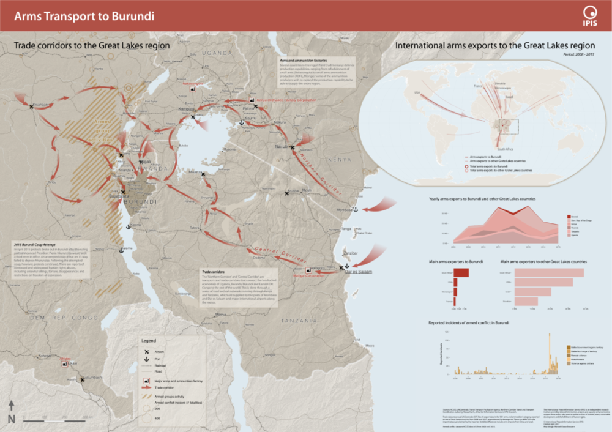
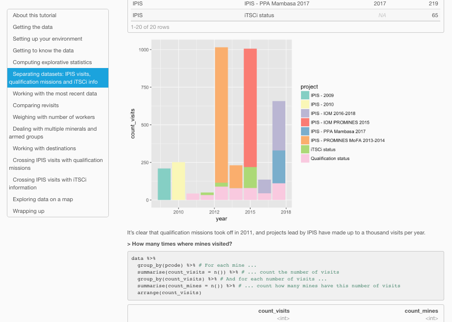
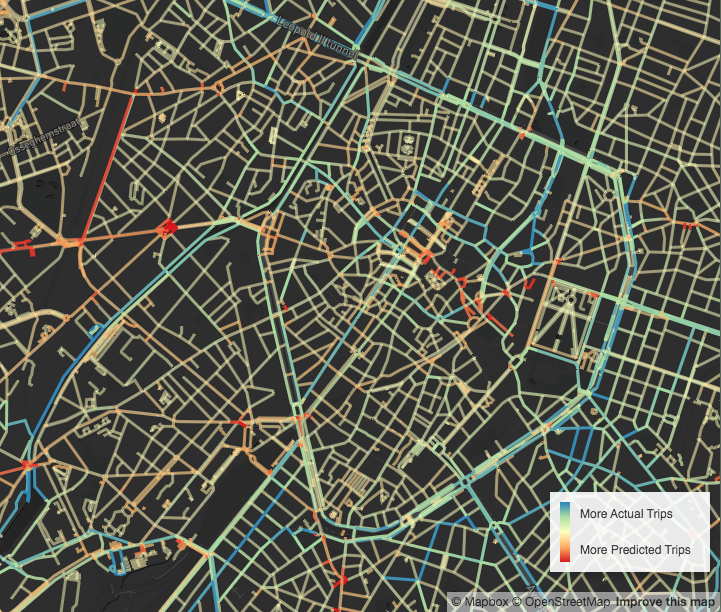
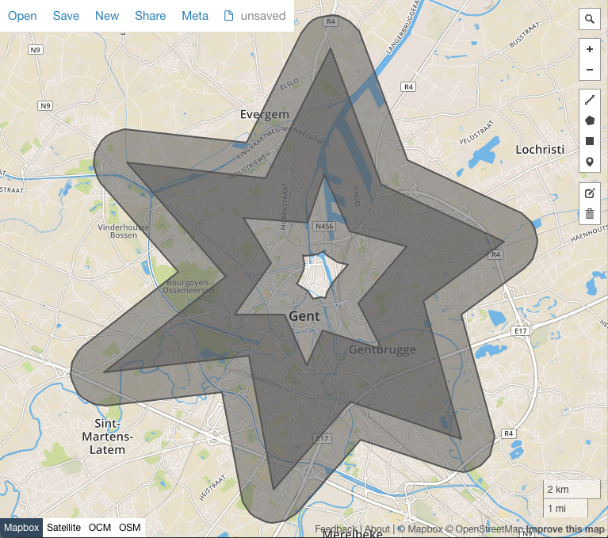

    
    

        <h2>Hi, I'm Manuel.</h2>
        

            As a freelance cartographer I make interactive and printed maps and apply geospatial algorithms for the greater good.
        

        

            <a href="mailto:manuel.claeys.b@gmail.com" class="email">manuel.claeys.b@gmail.com</a> 
            <a href="tel:+32485748811" class="phone">0485 74 88 11</a>
        

    

As a kid I've always loved flipping through atlasses and reading maps -- and the kid in me still loves this so much! It taught me to think abstractly and understand spatial relations. Today, I'm happy I can put this knowledge -- and love -- to use in my work.

# How I can help you

## I make interactive and printed maps

You have a lot of data and want to show it on a map? I use <mark>state-of-the-art</mark> tools to visualise your data as a static (printable) map or interactive (web-based) map. Together, we find the right balance between telling a story and making your data explorable.

Layer by layer, I carefully build up your map, complementing your data with Open Data, satellite imagery and graphs. With an <mark>eye for detail</mark> I take care of advanced aspects like label placement, relief shading and an accessible color system, all while respecting your visual identity.

## I help you make sense of your data

You need to match data in a messy Excel-sheet with some old shapefiles and have no idea (or appetite) getting started? Great, I love to structure information! I carefully clean your datasets, combine them in the right way and make <mark>notebook reports</mark> on your (spatial) research questions. I can also help you orient in the world of statistical tests, predictive models and Machine Learning and apply the most fitting approach. 

In the longer run, I can help you set up a <mark>data processing pipeline</mark>, enabling things like automated reports, connected databases and APIs. 

## I make geo-spatial algorithms work for you

You're faced with questions like "how many households in this dataset lie within a certain distance of polluting factories" or "what is the shortest route between all these points"? Some incredible geospatial algorithms have been developed for such questions in the fields of <mark>computational geometry, geodesy and routing</mark> -- but sometimes they can be quite scary. I can help you identify the useful ones for your project, implement them and deliver the resulting output, code and documentation. 

The engineer in me also looks forward to your <mark>remote sensing</mark> and hyperspectral image processing challenges.

<h1 class="with-margin-top">My work</h1>

I try to make maps for projects that matter. My work started off at university, and I love to support researchers big and small with the spatial representation of their work.

I have a particular interest in <mark>historical maps</mark>, and currently I'm spending most of my time on a super cool project called <a href="/projects/allmaps_thinplatespline" class="internal">Allmaps</a>, enabling anyone to include historical maps, served using the IIIF standard, in webmaps and other places using sharable 'georeference annotation' files. I previously did some work around <a href="/projects/academia_ferraris" class="internal">deformations</a> and <a href="/projects/ferrargis" class="internal">styling</a> in historical maps.

I've come to know that maps are not just a tool for understanding and planning, but have also been used for (abuse of) power and control. I try to be mindful of this history, learn more about it and question how we can go forward together.

I'm on team *Open Knowledge*; contributing to OpenStreetMap, using <mark>Open Source tools</mark>, writing documentation and sharing my own [code](https://github.com/mclaeysb). I'm inspired by writers and creators pushing for more open and human technology, in the field of GIS and beyond.

For my projects I've used tools like QGIS/GDAL -- Mapbox GL JS -- MapLibre GL JS -- OpenLayers -- Leaflet -- WebGL -- JavaScript/TypeScript/Node -- SQL/Postgres/PostGIS -- R/dplyr -- Python/Pandas/Jupyter -- CLI -- Git -- MatLab/Octave.

<h1 class="with-margin-top">Some examples</h1>

Organisations I've worked with include [Allmaps](https://allmaps.org/), [UGent department of Geography](http://geoweb.ugent.be/), [IPIS -- International Peace Information Service](https://ipisresearch.be/), [Endeavour](https://endeavours.eu/), [Heroes For Zero -- 1030/0](https://heroesforzero.be/), [ERU -- Etudes et Recherches Urbaines](https://eru-urbanisme.be/), ...

Here are some examples of map projects I've been involved in. You can click them to explore more -- I've tried to write what I've learned in each of them. I'm happy to share more about my previous projects upon request.

> An interactive and a printed map.

    
    

> Juggling with and learning from data.

    
    

> Geo-spatial algorithms for the win.

    
    

<h1 class="with-margin-top">Background</h1>

After my studies as an engineer in Applied Physics, I've followed by love for <mark>maps, Maths and geomatics</mark> and worked as a PhD student at the UGent department of Geography working on historical cartography (and their deformations), map projections and predictive algorithms. I later joined an NGO as a GIS-officer and data-scientist, making maps and helping researchers understand their data. I've also undertaken some GIS projects in my spare time: building a citizen-driven mobility plan, recreating 18th century map-style and computing the cycling potential of Brussels' streets.

I'm a human being, too. Proud that I can contribute with some things, also struggling with many others. Just trying my best every day, to be kind, be helpful. And while this website is about me (and what I do for work), it's really about us, about nurturing the commons, about affirming the alternatives that already exist, about recognising who we are -- *that* we are, here and alive in this 'existence' thing.

Next to my cartography work, I'm a freelance <a href="/facili" class="internal">facilitator</a>: I accompany organizations towards a more cooperative working-together.

<h1 class="with-margin-top">Contact</h1>

Want to talk more? Great!

Manuel Claeys Bouuaert
 Brussels, Belgium

<a href="mailto:manuel.claeys.b@gmail.com" class="email">manuel.claeys.b@gmail.com</a> 
<a href="tel:+32485748811" class="phone">0485 74 88 11</a>

`VAT: BE0747868317` --- `IBAN: BE31001904377455`

