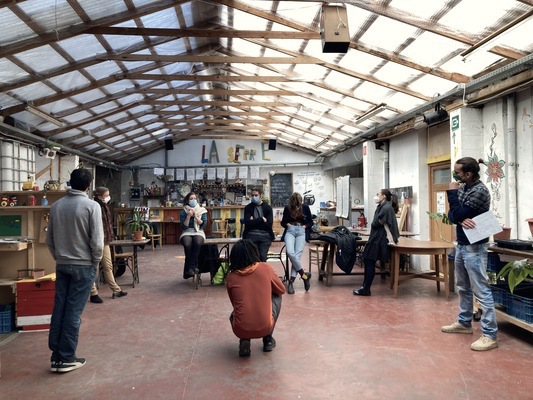

    <a href="/facili_nl" class="language">NL</a>
    <a href="/facili_fr" class="language">FR</a>

    
    

        <h2>Hi, I'm Manuel.</h2>
        

            As a freelance facilitator, I accompany organizations towards a more cooperative working-together.
        

        

            <a href="mailto:manuel.claeys.b@gmail.com" class="email">manuel.claeys.b@gmail.com</a> 
            <a href="tel:+32485748811" class="phone">0485 74 88 11</a>
        

    

<h1 class="with-margin-top">Organizing teamwork is quite an art</h1>

If you want to improve collaboration within your team, a lot of questions can come up:

> "<mark>How can we include people in decisions</mark> without spending so much time in meetings?"

> "An organisation built on <mark>self-organising teams</mark>, that sounds nice, but where do we start?"

> "How do we plan together in a realistic way, keep each other informed and <mark>adjust with agility</mark> when needed?"

It's my job to guide organizations taking on these challenges -- in <a href="/facili_nl" class="language">Dutch</a>, <a href="/facili_fr" class="language">French</a> or <a href="/facili" class="language">English</a>.

<h1 class="with-margin-top">How I can help</h1>

*A delicate meeting is coming up and you would like it to run fluently? Want to set the priorities for the coming year in a collaborative way during your team retreat? Organising a co-creation workshop and looking for an innovative approach?*

## I <mark>facilitate</mark> your meeting or workshop

I host your meeting as a neutral person to <mark>make it run smoothly</mark>: I can facilitate deliberation and decisionmaking using innovative processes (*Management By Consent*, *Moving Debate*, ...) or can put in place a series of creative workshops to brainstorm in group and look at your topic from all possible perspectives (*Hats of Bono*, *World Café*, ...). Through my posture, I hold a space in which everyone's contribution is <mark>heard and appreciated</mark>.

*Your team is leaving behind a classic hierarchical structure, but sometimes this leads to ambiguity and uncertainty? People don't feel involved in important decisions -- or rather too often? Would you like to tap into the wisdom of each team member to collaboratively steer your project in the right direction?*

## I accompany you towards a <mark>self-managing organisation</mark>

I work with you on <mark>clear mandates</mark>, a good flow of information and clarity about what is decided where, based on the principles of *Sociocracy* and *Holacracy*. By starting from the <mark>concrete challenges</mark> you are experiencing today, and through bonding methodologies, I carefully guide you towards a lively, sustainable change.

*Are you looking for a SCRUM-master for your purposeful project to keep your (technical) team running smoothly during the next months? You need a new management tool whose implementation will have consequences for your internal operations, and want this to be prepared well and followed up?*

## I make your <mark>technical team</mark> run smoothly

Together with your team I investigate which tools from *Agile project management* can make the internal organization run more smoothly (*Backlogs* and *Sprints*, *Stand Up Meetings*, *Retrospectives*, ...). I implement and facilitate them (aided by my <mark>own experience with SCRUM</mark> as a software developer) until your team, in term, is independent. I bring this *Agile* approach together with the principles and posture from *Collective Intelligence* and *Deep Democracy*, because technology only really makes us go a step forward if it is developed <mark>in a supported way</mark>.

Often a request is somewhere in between and/or clarifying it is part of the assignment. Feel free to contact me and I'll see what custom approach I can propose.

<h1 class="with-margin-top">My experience</h1>

As a <mark>trilingual (NL/FR/EN)</mark> freelance facilitator I support purposeful companies and projects in what they want to achieve, but more importantly, in their working-together --- as a powerful and transformative goal in itself.

I facilitate in service of companies and the public sector as well as for non-profit organizations, cooperatives and citizen collectives, ranging from small teams to well-attended general assemblies. Live if possible, by video conference if that's more appropriate. My home base is <mark>Brussels</mark> and I am mobile within Belgium.

**Already entrusted me with their process:**

> [NorWest](https://www.norwest.be/nl/), [Confluences](https://www.confluences.eu/), [MicroMarché](http://www.micromarche.com/), [Heroes For Zero - 1030/0](https://heroesforzero.be/), [Autrement-dit](https://www.autrement-dit.be/), [ERU - Etudes et Recherches Urbaines](https://eru-urbanisme.be/), ...

    
    

A diverse network of facilitators is growing in Brussels — and I cooperate with some of them on a regular basis. I am a better facilitator thanks to the open culture, innovative viewpoints and constructive intervision that exist in this group.

<h1 class="with-margin-top">My background</h1>

In my job as a facilitator I rely on more than 10 years of experience in various projects, where I increasingly supplemented my <mark>analytical approach</mark> with a role as <mark>process supervisor</mark> --- two sides that reinforce each other.

I graduated as an engineer in Applied Physics and worked as a PhD student, as a data scientist at an NGO and as a software engineer at a self-managed workers' cooperative. I worked in research teams, led complex restructurings of data pipelines and facilitated team retreats. Also, for a long time I've been active in youth work with an inclusive and creative approach, and I am involved as a facilitator in the citizens' movement for deliberative democracy [Agora](https://agora.brussels). As I lean on these experiences, I'm mindful of the teamwork they represent, the shoulders I'm standing on and privilege I've received.

Besides the fact that I like to stand in front of groups I also make printed and interactive maps as a freelance <a href="/carto" class="internal">cartographer</a>, including data management and programming.

    
    

<h1 class="with-margin-top">My rate</h1>

Compensation can be arranged in the traditional way: during our contact, we can find out what's possible based on my rate <mark>per hour or per day</mark> and your available resources. Alternatively, if you wish, we can also jointly experiment with more shared forms of compensation such as a *Conscious Exchange*.

<h1 class="with-margin-top">Contact</h1>

I'm curious about your question, so get in touch! I'll analyse it diligently, propose an approach and we'll map out an appropriate route together.

To be able to help you as best as possible, it's useful to know the following: your situation, the size of the group and possibly the date and location.

## <mark>Contact me</mark>
<a href="mailto:manuel.claeys.b@gmail.com" class="email">manuel.claeys.b@gmail.com</a> 
<a href="tel:+32485748811" class="phone">0485 74 88 11</a>

Manuel Claeys Bouuaert --- `VAT: BE0747868317` --- `IBAN: BE31001904377455`

