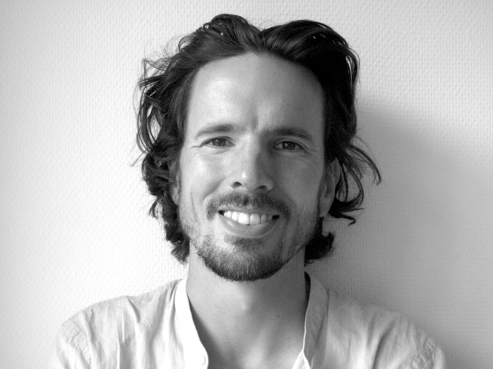
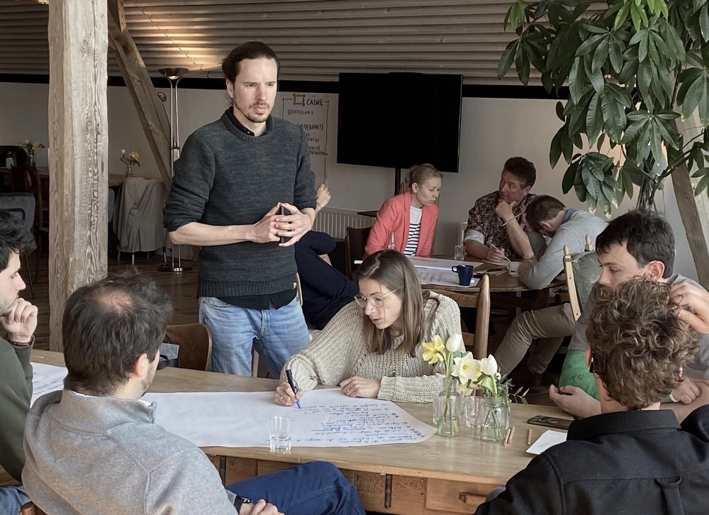

    <a href="/facili_nl" class="language">NL</a>
    <a href="/facili_fr" class="language">FR</a>

    
    

        <h2>Hi, I'm Manuel.</h2>
        

            As a freelance facilitator, I accompany organizations towards a more cooperative working-together.
        

        

            <a href="mailto:manuel.claeys.b@gmail.com" class="email">manuel.claeys.b@gmail.com</a> 
            <a href="tel:+32485748811" class="phone">0485 74 88 11</a>
        

    

Teams that <mark>organise with intention</mark> can move mountains -- and team-work with compassion can *move us* even more.

The road to get there goes through <mark>dedicated places for nuanced conversation</mark> that don’t require a function title to participate but just an open mind and the ability to listen.

That’s where I can be of help: as a facilitator <mark>I’m here to help your team talk</mark> about what you do, how you do it and most importantly *why* you do it -- by holding space and bringing the appropriate methodologies. In <a href="/facili_nl" class="language">Dutch</a>, <a href="/facili_fr" class="language">French</a> or <a href="/facili" class="language">English</a>.

<h1 class="with-margin-top">How I can help</h1>

## I facilitate your meeting or workshop

Want to set the priorities for the coming year during your team retreat? Ready to have a talk about that one issue that's never being openly discussed? It can be quite a challenge to have a fruitful conversation when you're a big team. As a facilitator I can prepare and host your meeting or workshop as a neutral person to <mark>make it run smoothly</mark>. 

My toolbox includes methodologies for <mark>deliberation and decision making</mark> (*Management By Consent*, *Moving Debate*, ...) as well as ideation and creativity (*Hats of Bono*, *World Café*, ...). They can be used to jointly answer questions like "What values drive us? How can we change what we do, and how we work together, to really push those forward?" Through my posture, I hold a space in which everyone's contribution is heard and appreciated.

## I help mature self-managing teams

Your team is leaving behind a classic hierarchical structure, but sometimes this leads to ambiguity and uncertainty? Based on the principles of *Sociocracy* and *Holacracy* I work with you on <mark>clear mandates</mark>, a good flow of information and clarity about what is decided where. We look for a balance that includes people in decisions without spending too much time in meetings.

Starting from the <mark>concrete challenges</mark> and evolving context you experience today I carefully guide you towards a lively, sustainable change.

## I accompany your technical team

Are you looking for a SCRUM-master to guide the working-together of your team of ITers or engineers? Aided by my own experience with SCRUM as a software developer, I look at which <mark>tools from Agile project management</mark> can make the internal organization run more smoothly (*Backlogs* and *Sprints*, *Stand Up Meetings*, *Retrospectives*, ...) and implement and facilitate them with the goal of making your team self-managing. 

While these tools can make your team more agile and efficient, technology only really makes us take a step forward if it's developed in an <mark>inclusive and purposeful</mark> way. Therefore I also bring the principles and posture from *Collective Intelligence* and *Deep Democracy* with me in this role.

I’m sure your situation or request doesn't quite fit these boxes. Let's talk!

<h1 class="with-margin-top">My work</h1>

As a <mark>trilingual (NL/FR/EN)</mark> freelance facilitator I support purposeful companies and projects in what they want to achieve, but more importantly, in their working-together --- as a powerful and transformative goal in itself.

I facilitate all kinds of organisations, and have a special focus on teams working on technical subjects and on citizen collectives. My home base is <mark>Brussels</mark> and I am mobile within Belgium. I also do remote facilitation work from time to time.

A diverse <mark>network of facilitators</mark> is growing in Brussels and I cooperate with some of them on a regular basis. I am a better facilitator thanks to the open culture, innovative viewpoints and constructive intervision that exist in this field.

Investing in a better working-together, and taking ownership of our agency, is a human endeavour. It can be eye-opening, renewing, fun, frustating and messy. It can create belonging and connection. It goes step by step. It takes time. And I think it's worth it.

    
    

<h1 class="with-margin-top">Some examples</h1>

Organisations I've worked with include [Infrabel](https://infrabel.be), [Shayp](https://shayp.com/), [Equal Partners](https://equal-partners.eu/), [Teach for Belgium](https://teachforbelgium.be/), [CIRB -- paradigm.brussels](https://paradigm.brussels), [Gemeente Schaarbeek](https://www.1030.be/nl/agenda/muzik1030-network), [Art et Marges](https://www.artetmarges.be/), ...

Here are some examples of moments I facilitated:

> Network day

Brussels museum Art et Marges organised a network day with 100 animators of artistic workshops from affiliated organisations. They aimed to create a moment of connection, exchange and co-creation on future joint projects. I proposed methodologies for moments in small teams, one-on-one as well as all together, helped with practical preparations and guided the participants through their day.

> One-day team retreat

Teach For Belgium had been experimenting with self-managing teams for a while, and wanted to rethink how to align those teams through-out the work-year. I designed a one-day team retreat around this question with times to explore possibilities, weigh options, make a choice and make it concrete. They implemented (and kept improving) the resulting approach.

> Sustainable innovation trajectory

Infrabel, who manages the Belgian rail infrastructure, wanted to foster more innovation and cooperation across its departments through a sustainable innovation trajectory for young employees. I joined a team of facilitators through the collective Impact Valley, and animated the '4D' innovation methodology for a small, young, cross-functional team composed of technicians, ITers and strategic planners. I guided them from values to brainstorm over value proposition to testable prototype.

    
    

<h1 class="with-margin-top">Background</h1>

In my job as a facilitator I rely on more than 10 years of experience in various projects, where I increasingly supplemented my analytical approach with a role as process supervisor --- two sides that reinforce each other.

I graduated as an <mark>engineer in Applied Physics</mark> and worked as a PhD student, as a data scientist at an NGO and as a software engineer at a self-managed workers' cooperative. I worked in research teams, led complex restructurings of data pipelines and facilitated team retreats. Also, for a long time I've been active in youth work with an inclusive and creative approach, and I am involved as a <mark>facilitator in the citizen collective</mark> for deliberative democracy called [Agora](https://agora.brussels). As I lean on these experiences, I'm mindful of the teamwork they represent, the shoulders I'm standing on and privilege I've received.

My practical experience is complemented by training in facilitation techniques and posture through a.o. Université du Nous (*Atelier du Nous*) and Collectiv-a (*Posture de Facilitation*).

I'm a human being, too. Proud that I can contribute with some things, also struggling with many others. Just trying my best every day, to be kind, be helpful. And while this website is about me (and what I do for work), it's really about us, about nurturing the commons, about affirming the alternatives that already exist, about recognising who we are -- *that* we are, here and alive in this 'existence' thing.

Besides the fact that I like to stand in front of groups I also make printed and interactive maps as a freelance <a href="/carto" class="internal">cartographer</a>, including data management and programming.

<h1 class="with-margin-top">Contact</h1>

You're looking to experiment and innovate with collaborative methods? To build and live collective dialogue and action? Great, lets talk!

Manuel Claeys Bouuaert
 Brussels, Belgium

<a href="mailto:manuel.claeys.b@gmail.com" class="email">manuel.claeys.b@gmail.com</a> 
<a href="tel:+32485748811" class="phone">0485 74 88 11</a>

`VAT: BE0747868317` --- `IBAN: BE31001904377455`

