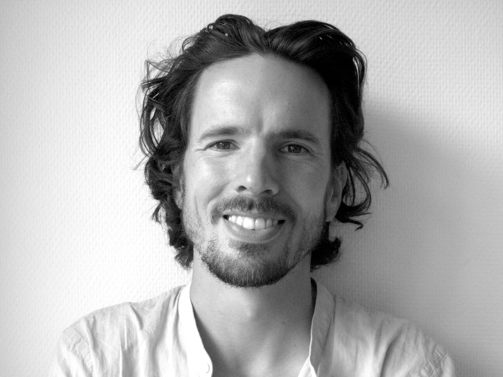
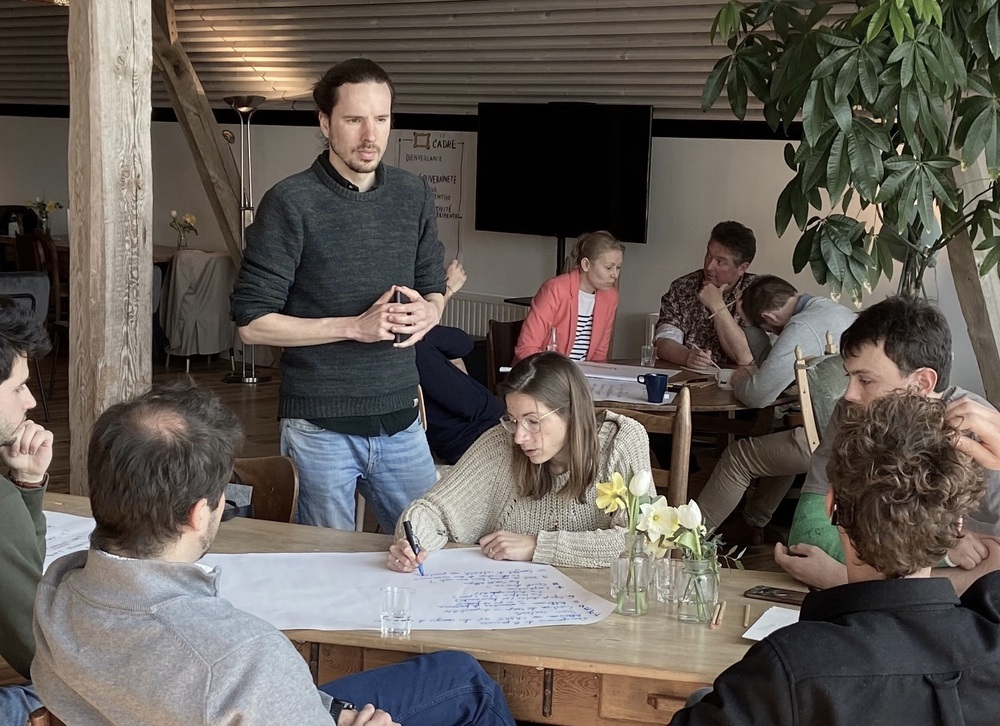
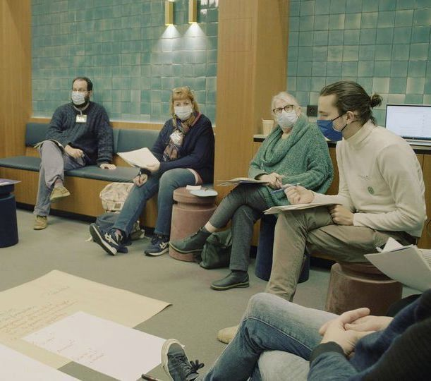
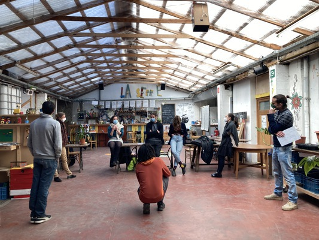
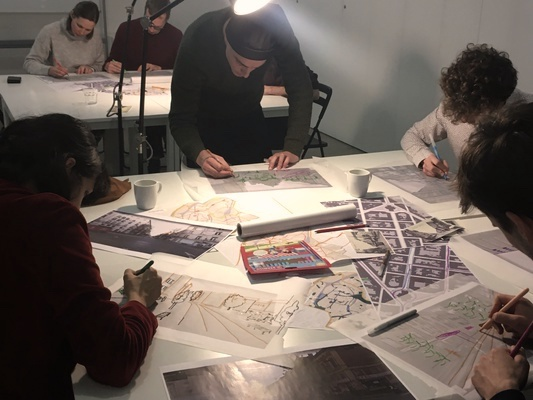

    <a href="/facili_nl" class="language">NL</a>
    <a href="/facili" class="language">EN</a>

    
    

        <h2>Bonjour, moi c'est Manuel.</h2>
        

            En tant que facilitateur indépendant, j'accompagne des organisations vers un faire-ensemble plus coopératif.
        

        

            <a href="mailto:manuel.claeys.b@gmail.com" class="email">manuel.claeys.b@gmail.com</a> 
            <a href="tel:+32485748811" class="phone">0485 74 88 11</a>
        

    

<h1 class="with-margin-top">L'intention avec laquelle les organisations utilisent leur pouvoir changera tout</h1>

Les équipes qui <mark>s'approprient de leur capacité d'agir</mark> peuvent mouvoir des montagnes -- et un travail d'équipe avec compassion peut *nous émouvoir* encore plus.

La route pour y arriver passe par <mark>des lieux dédiés à une conversation nuancée</mark> qui ne nécessitent pas de titre de fonction pour participer mais juste un esprit ouvert et la capacité d'écouter.

C'est là que j'interviens : en tant que facilitateur <mark>j'aide votre équipe à parler</mark> de ce que vous faites, comment vous le faites et surtout *pourquoi* vous le faites -- en tenant le cadre et en apportant les méthodologies appropriées. En <a href="/facili_nl" class="language">néerlandais</a>, <a href="/facili_fr" class="language">français</a> ou <a href="/facili" class="language">anglais</a>.

<h1 class="with-margin-top">Comment je peux aider</h1>

## J'anime votre <mark>réunion ou atelier</mark>

Vous souhaitez définir les priorités pour l'année à venir lors de votre mise au vert ? Êtes-vous prêts à avoir une conversation sur ce sujet qui n'est pas discuté ouvertement ? Cela peut être tout un challenge d'avoir une conversation fructueuse quand on est une grande équipe. Comme facilitateur, je viens <mark>guider le déroulement</mark> de votre réunion en tant que personne neutre.

Ma boite à outils contient des méthodologies pour <mark>délibérer et prendre des décisions</mark> (*Management By Consent*, *Moving Debate*, ...) ainsi que pour des moments de brainstorming et de créativité (*Chapeaux de Bono*, *World Café*, ...). Via ma posture, j'essaie d'offrir un cadre dans lequel la contribution de chacun est entendue et appréciée.

## Je vous guide vers une <mark>organisation autogérée</mark>

Votre équipe a abandonné une structure hiérarchique classique, mais cela mène parfois à de l'ambiguïté et de l'incertitude ? Basé sur les principes de la *Sociocratie* et la *Holacratie*, je travaille avec vous sur des <mark>mandats clairs</mark>, un bon flux d'informations et une clarté sur ce qui est décidé où. On part à la recherche d'un équilibre pour inclure des gens dans la prise de décision sans passer tout son temps dans des réunions. 

En partant des <mark>défis concrets</mark> et de l'évolution du context que vous vivez aujourd'hui, je guide avec soin votre trajet vers un changement vivant et durable.

## J'accompagne votre <mark>équipe technique</mark>

Vous recherchez un SCRUM-master afin d'assurer un bon fonctionnement dans votre équipe technique? Aidé par ma propre expérience SCRUM en tant que développeur, je regarde quels <mark>outils de la gestion de projet Agile</mark> peuvent rendre l'organisation interne plus fluide (*Backlogs* et *Sprints*, *Stand Up Meetings*, *Retrospectives*, ...) et je les mets en œuvre et les facilite jusqu'à ce que à terme votre équipe soit indépendante. 

Si ces outils savent rendre votre équipe plus agile et efficace, la technologie ne nous fait que vraiment prendre un pas en avant si elle est développée d'une façon <mark>inclusive et avec sens</mark>. Pour cela, j'apporte les principes et attitudes de l'*Intelligence Collective* et de la *Démocratie Profonde* dans ce rôle.

Sûrement votre situation ou demande ne correspond pas tout à fait à ces cases. Contactez-moi pour qu'on en parle !

<h1 class="with-margin-top">Mes spécificités</h1>

En tant que facilitateur indépendant <mark>trilingue (NL/FR/EN)</mark>, j'accompagne les entreprises et les projets engagés dans ce qu'ils veulent réaliser, mais plus encore, dans leur manière de faire-ensemble --- comme objectif puissant et transformateur en soi.

Je facilite toute sorte d'organisations, et j'ai un focus particulier sur les entreprises tech et les collectifs citoyens. Mon port d'attache est <mark>Bruxelles</mark> et je suis mobile en Belgique. De temps en temps, je facilite aussi des réunions en visioconférence.

Un <mark>réseau diversifié de facilitateurs</mark> se développe à Bruxelles — et je travaille régulièrement avec certains d'entre eux. Je suis un meilleur facilitateur grâce à la culture ouverte, au regard innovant et à l'intervision constructive qui y règnent.

**M'ont déjà confié leur processus :**

> [Infrabel.be](https://infrabel.be), [Shayp](https://shayp.com/), [Equal Partners](https://equal-partners.eu/), [Teach for Belgium](https://teachforbelgium.be/), [Heroes For Zero - 1030/0](https://heroesforzero.be/), [ERU - Etudes et Recherches Urbaines](https://eru-urbanisme.be/), ...

    
    

<h1 class="with-margin-top">Mon parcours</h1>

Dans mon travail de facilitateur, je m'appuie sur plus de 10 ans d'expérience dans divers projets, au cours desquels j'ai de plus en plus complété mon approche analytique par un rôle d'accompagnement de processus --- deux côtés qui se renforcent mutuellement.

J'ai obtenu mon diplôme d'<mark>ingénieur en physique appliquée</mark> et j'ai travaillé comme doctorant, comme data scientist dans une ONG et comme développeur de logiciel dans une coopérative de travailleurs autogéré. J'ai travaillé dans des équipes de recherche, dirigé des restructurations complexes de pipelines de données et facilité des mises au verts. J'ai également été longtemps actif dans le travail de jeunesse avec une approche inclusive et créative, et je suis impliquée en tant que <mark>facilitateur dans le mouvement citoyen</mark> pour une démocratie délibérative [Agora](https://agora.brussels). Je peux m'appuyer sur ces expériences, étant conscient du travail d'équipe qu'elles représentent, des épaules sur lesquelles je me tiens et des privilèges que j'ai reçus.

Mon expérience pratique est complétée par des formation de techniques et de postures de facilitation à travers e.a. Université du Nous (*Atelier du Nous*) et Collectiv-a (*Posture de Facilitation*).

Outre le fait que j'aime me tenir devant des groupes, en tant que <a href="/carto" class="internal">cartographe</a> indépendant je réalise également des cartes imprimées et interactives, y compris la gestion des données et la programmation.

    
    

<h1 class="with-margin-top">Contact</h1>

En parler plus ? Top !

<a href="mailto:manuel.claeys.b@gmail.com" class="email">manuel.claeys.b@gmail.com</a> 
<a href="tel:+32485748811" class="phone">0485 74 88 11</a>

Manuel Claeys Bouuaert --- `VAT: BE0747868317` --- `IBAN: BE31001904377455`
