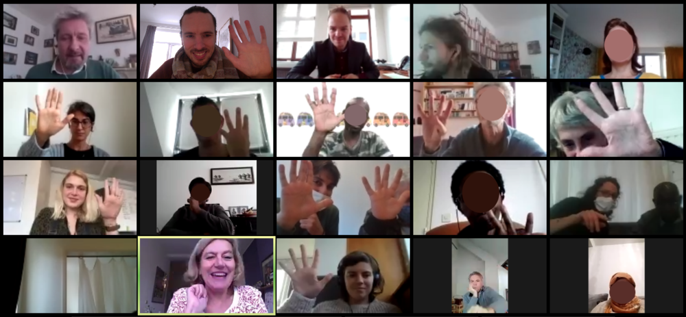

    <a href="/facili" class="language">EN</a>
    <a href="/facili_fr" class="language">FR</a>

    
    

        <h2>Hallo, ik ben Manuel</h2>
        

            Als freelance facilitator begeleid ik organisaties naar een meer coöperatief samen-werken.
        

        

            <a href="mailto:manuel.claeys.b@gmail.com" class="email">manuel.claeys.b@gmail.com</a> 
            <a href="tel:+32485748811" class="phone">0485 74 88 11</a>
        

    

<h1 class="with-margin-top">Teamwerk organiseren is een hele kunst</h1>

Als u de samenwerking in uw team wilt verbeteren, dan kunnen daar heel wat vragen bij komen kijken:

> "<mark>Hoe betrekken we mensen bij beslissingen</mark> zonder zoveel tijd in meetings te spenderen?"

> "Een organisatie opgebouwd uit <mark>zelfsturende teams</mark>, dat klinkt mooi, maar hoe beginnen we daaraan?"

> "Hoe plannen we samen op een realistische manier, houden we elkaar efficient op de hoogte en <mark>sturen we wendbaar bij</mark> wanneer nodig?"

Het is mijn job organisaties te begeleiden bij het opnemen van deze uitdagingen -- in het <a href="/facili_nl" class="language">Nederlands</a>, <a href="/facili_fr" class="language">Frans</a> of <a href="/facili" class="language">Engels</a>.

<h1 class="with-margin-top">Hoe ik kan helpen</h1>

*Komt er een delicate vergadering aan die u graag vlot wil laten verlopen? Wilt u tijdens uw teambuilding op een gedragen manier de prioriteiten voor het komende jaar scherpstellen? U moet een co-creatie workshop organiseren en bent op zoek naar een vernieuwende aanpak?*

## Ik <mark>faciliteer</mark> uw vergadering of workshop

Ik kom jullie vergadering als neutrale persoon <mark>in goede banen leiden</mark>, of verzorg bijvoorbeeld een reeks creatieve workshops. Via passende methodieken help ik jullie efficient overleggen en beslissingen nemen (*Management By Consent*, *Moving Debate*, ...) en/of vanuit alle mogelijke blikken te brainstormen in groep (*Chapeaux de Bono*, *World Café*, ...). Ik probeer via mijn houding een kader te bieden waarin eenieders bijdrage <mark>gehoord en gewaardeerd</mark> wordt. 

*Uw team laat een klassieke hiërarchische structuur achter zich, maar dat leidt soms tot onduidelijkheid en onzekerheid? Men voelt zich niet betrokken bij belangrijke beslissingen -- of net te vaak? U wil graag de wijsheid van elk teamlid aanboren om samen de juiste richting uit te gaan?*

## Ik begeleid u naar een <mark>zelfsturende organisatie</mark>

Ik werk samen met jullie aan <mark>heldere mandaten</mark>, een goede informatiestroom en duidelijkheid over wat waar beslist wordt, vertrekkend vanuit de principes van de *Sociocratie* en *Holacratie*. Door te beginnen vanuit de <mark>concrete uitdaging</mark> die jullie vandaag ervaart en via verbindende methodieken begeleid ik zorgzaam jullie traject naar een levende, duurzame verandering.

*U zoekt een SCRUM-master voor uw geëngageerd project om gedurende de volgende maanden uw (technisch) team vlot te laten draaien? U hebt een nieuwe beheerstool nodig waarvan de implementatie ook gevolgen heeft voor uw interne werking en wilt dat dit goed voorbereid en opgevolgd wordt?*

## Ik laat uw <mark>technisch team</mark> vlotter draaien

Samen met uw team kijk ik welke tools uit *Agile project management* de interne organisatie vlotter kunnen laten verlopen (*Backlogs* en *Sprints*, *Stand Up Meetings*, *Retrospectives*, ...). Ik implementeer en faciliteer deze (geholpen door mijn <mark>eigen ervaring met SCRUM</mark> als software-ontwikkelaar) tot uw team hier op termijn zelfstandig in is. Ik breng deze *Agile* aanpak samen met de principes en attitudes uit *Collective Intelligence* en *Deep Democracy*, omdat technologie pas echt tot een stap voorwaards leidt als ze <mark>op een gedragen manier</mark> wordt ontwikkeld.

Vaak bevindt een nood zich ergens tussenin en/of is het verduidelijken ervan deel van de opdracht. Contacteer me, dan bekijk ik welke aangepaste aanpak ik kan voorstellen.

<h1 class="with-margin-top">Mijn ervaring</h1>

Als <mark>drietalige (NL/FR/EN)</mark> freelance facilitator ondersteun ik geëngageerde bedrijven en projecten in wat ze willen waarmaken, maar meer nog, in hoe ze daarbij kunnen samen-werken --- als krachtig en transformatief doel op zich. 

Ik faciliteer zowel voor bedrijven en de publieke sector als voor vzw's, cooperatieven en burgercollectieven, gaande van kleine teams tot druk bijgewoonde algemene vergaderingen. Live als het kan, per videoconferentie als dat passender is. Mijn thuisbasis is <mark>Brussel</mark> en ik ben mobiel binnen België.

**Vertrouwden mij hun proces al toe:**

> [NorWest](https://www.norwest.be/nl/), [Confluences](https://www.confluences.eu/), [MicroMarché](http://www.micromarche.com/), [Heroes For Zero - 1030/0](https://heroesforzero.be/), [Autrement-dit](https://www.autrement-dit.be/), [ERU - Etudes et Recherches Urbaines](https://eru-urbanisme.be/), ...

    
    

In Brussel groeit een divers netwerk aan facilitatoren — en met sommigen werk ik regelmatig samen. Ik ben een betere facilitator dankzij de open cultuur, vernieuwende blik en constructieve intervisie die er leven.

<h1 class="with-margin-top">Mijn achtergrond</h1>

In mijn job als facilitator leun ik verder op meer dan 10 jaar ervaring in diverse projecten, waarbij ik steeds vaker mijn <mark>analytische insteek</mark> aanvulde met een rol als <mark>procesbegeleider</mark> --- twee kanten die elkaar versterken. 

Ik studeerde af als ingenieur in de Toegepaste Natuurkunde en werkte als PhD student, als data-scientist bij een NGO en als software-ingenieur bij een zelfsturende werkerscoöperatie. Ik werkte in onderzoeksteams, leidde complexe herstructureringen van data pipelines en faciliteerde team-retraites. Ik was ook lang actief in jeugdwerk met een inclusieve en creatieve insteek en ben als facilitator betrokken bij de burgerbeweging voor deliberatieve democratie [Agora](https://agora.brussels). Terwijl ik leun op deze ervaringen, ben ik me bewust van het teamwerk dat ze vertegenwoordigen, de schouders waarop ik sta en de privileges die ik heb gekregen.

Naast het feit dat ik graag voor groepen sta, maak ik als freelance <a href="/carto" class="internal">cartograaf</a> ook geprinte en interactieve kaarten, incl. data-beheer en programmeerwerk.

    
    

<h1 class="with-margin-top">Mijn tarief</h1>

Een vergoeding kan op de klassieke manier geregeld worden: bij ons contact kijken we samen wat mogelijk is op basis van mijn tarief <mark>per uur of dagdeel</mark> en uw beschikbare middelen. Alternatief kunnen we ook, als u dat wil, samen experimenteren met meer gedeelde vormen van vergoeding zoals een *Conscious Exchange*.

<h1 class="with-margin-top">Contact</h1>

Ik ben benieuwd naar uw vraag, dus neem alvast contact op! Dan analyseer ik ze toegewijd, stel u een aanpak voor en stippel samen met u het gepaste traject uit.

Om u zo goed mogelijk te kunnen helpen is het handig om de volgende zaken te vermelden: uw situatie, de grootte van de groep en eventueel de datum en locatie.

## <mark>Contacteer me</mark>
<a href="mailto:manuel.claeys.b@gmail.com" class="email">manuel.claeys.b@gmail.com</a> 
<a href="tel:+32485748811" class="phone">0485 74 88 11</a>

Manuel Claeys Bouuaert --- btw: be0747868317 --- iban: be31001904377455

